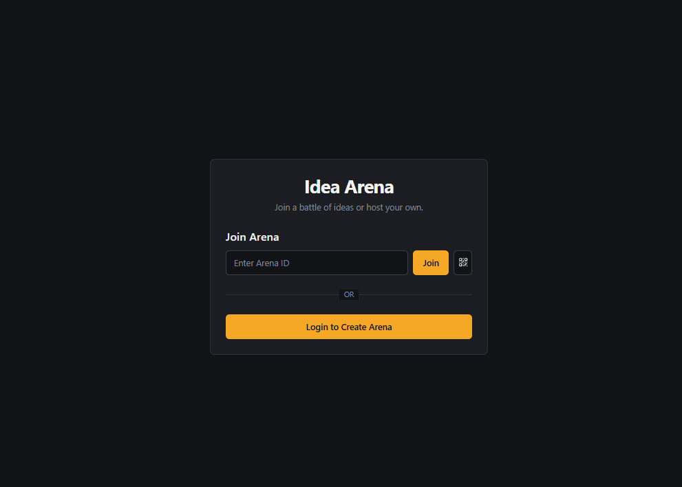

# Idea Arena

Idea Arena allows you to create "arenas" where you can compare and rank ideas, products, or images. 




## Features

- **Create Arenas**: Set up arenas with competitors, descriptions, and images.
- **Voting**: Vote on pairs of competitors.
- **Rankings**: View leaderboards, win rates, and stats.
- **Sharing**: Share arenas via QR codes.
- **Auth**: User management via Firebase Authentication.

## Tech Stack

- **Frontend**: React, TypeScript, Vite
- **UI**: Tailwind CSS, Shadcn UI
- **Backend**: Firebase (Firestore, Auth, Storage)

## Getting Started

Follow these instructions to set up the project locally.

### Prerequisites

- Node.js (v18+)
- Firebase Project

### Installation

1.  **Clone the repository**
    ```bash
    git clone https://github.com/quochung-cyou/idea-arena.git
    cd idea-arena
    ```

2.  **Install dependencies**
    ```bash
    npm install
    ```

### Configuration

1.  Open `src/lib/firebase.ts`.
2.  Update the `firebaseConfig` object with your credentials.

    ```typescript
    const firebaseConfig = {
      apiKey: "YOUR_API_KEY",
      authDomain: "YOUR_PROJECT_ID.firebaseapp.com",
      projectId: "YOUR_PROJECT_ID",
      storageBucket: "YOUR_PROJECT_ID.appspot.com",
      messagingSenderId: "YOUR_MESSAGING_SENDER_ID",
      appId: "YOUR_APP_ID"
    };
    ```

### Running Locally

Start the development server:

```bash
npm run dev
```

The app will run at `http://localhost:5173`.

## Project Structure

- `src/pages`: Main route components.
- `src/components`: UI components.
- `src/lib`: Utilities and Firebase config.
- `src/hooks`: Custom hooks.
- `src/contexts`: Context providers.

## License

MIT License.
